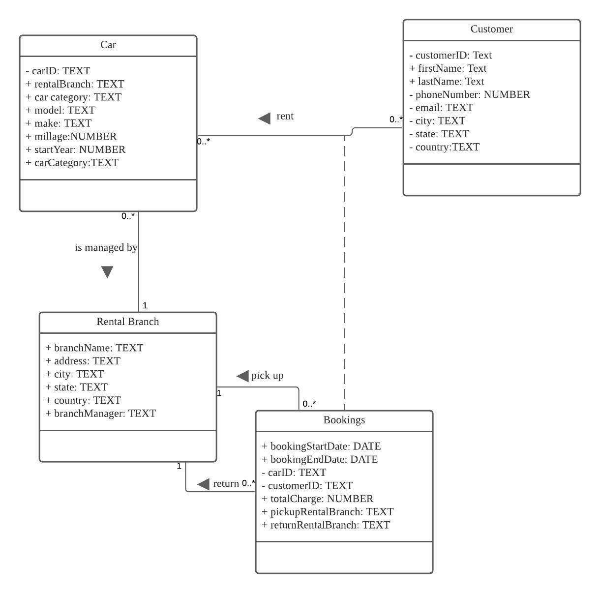

# Building an management system for a car rental company
## Purpose Statement
We aim to develop a web-based management system for a car rental company. It has two main functionalities: 
1. Facilitate the rental company to manage their car fleet. For example: the rental company can add a new car to their fleet, update a car's rental price and other information, or delete an existing car from the fleet. 
2. Provide a powerful tool for the rental company to monitor their business activities in all aspects. For example: the system can display all the cars owned by the rental company, fleets at different locations, amount of transactions per month, number of customers etc. By closely monitoring their business data, the rental company can adjust business strategies based on performance as well as gain a better understanding of their customers in order to promote the quality of service. 

## UML Diagram
https://lucid.app/lucidchart/722ed355-65d1-47df-9cc8-3ba5faa57deb/edit?beaconFlowId=341BAFE5E164E51C&invitationId=inv_6ba983b6-83d2-4e74-866d-5fbff519bbd8&page=0_0#

## ERD Diagram
https://lucid.app/lucidchart/4cc47107-7d20-475b-9944-03504518d9ac/edit?page=0_0&invitationId=inv_9cbd9f0a-f83d-4c95-931b-c6932ece15a2#

## Business requirement 
Please see file: businessRequirement.pdf

## SQL data definition statements 
Please see file "createTable.sql" under the folder "CreateTableSQL"

## How we populated the database using test data
Please see other files under the folder "CreateTableSQL", which include the commands we used to populate the database

## 5 queries we wrote for the database
Please see the file "project_queries.sql"

## Database schemas and proof that they are in BCNF:

Car(carID, currentRentalBranchID, carCategoryID, modelID, makeID, startYear, mileage, isAvailable)
Customer(customerID, firstName, lastName, phoneNumber, email, city, state, country)
Booking(bookingID, bookingStartDate, bookingEndDate, carID, customerID, totalCharge, pickupRentalBranchID, returnRentalBranchID)
RentalBranch(rentalBranchID, branchName, address, city, state, country, branchManager)
Car Category(categoryID, categoryType)
Car Model(modelID, model)
Car Make(makeID, make)

Proof that our schemas are in BCNF:
They are in 1NF because all the attributes in all schemas are single-valued.
To prove the schema is in 2NF and BCNF, list out all the functional dependencies in each schema:
    
    Car:
    carID -> currentRentalBranchID
    carID -> carCategoryID
    carID -> modelID
    carID -> makeID
    carID -> startYear
    carID -> mileage
    carID -> isavailable
    
There’s only one primary key in this table. All the attributes in the Car schema are only and fully dependent on the primary key alone. Therefore this schema is in 2NF and BCNF. 

    Customer:
    customerID -> firstName
    customerID -> lastName
    customerID -> phoneNumber
    customerID -> email
    customerID -> city
    customerID -> state
    customerID -> country
    
There’s only one primary key in this table. All the attributes in the Customer schema are only and fully dependent on the primary key alone. Therefore this schema is in 2NF and BCNF.
    
    Booking:
    bookingID -> bookingStartDate
    bookingID -> bookingEndDate
    bookingID -> carID
    bookingID -> customerID
    bookingID -> totalCharge
    bookingID -> pickupRentalBranchID
    bookingID -> returnRentalBranchID
    
There’s only one primary key in this table. All the attributes in the Booking schema are only and fully dependent on the primary key alone. Therefore this schema is in 2NF and BCNF.

    RentalBranch:
    rentalBranchID -> branchName
    rentalBranchID -> address
    rentalBranchID -> city
    rentalBranchID -> state
    rentalBranchID -> country
    rentalBranchID -> branchManager

There’s only one primary key in this table. All the attributes in the RentalBranch schema are only and fully dependent on the primary key alone. Therefore this schema is in 2NF and BCNF.

    Car Category:
    categoryID -> categoryType
    
    Car Model:
    modelID -> model

    Car Make:
    makeID -> make
    
There’s only one primary key in these tables. All the attributes in these three schemas are only and fully dependent on their respective primary key alone. Therefore, these schemas are in 2NF and BCNF. 

